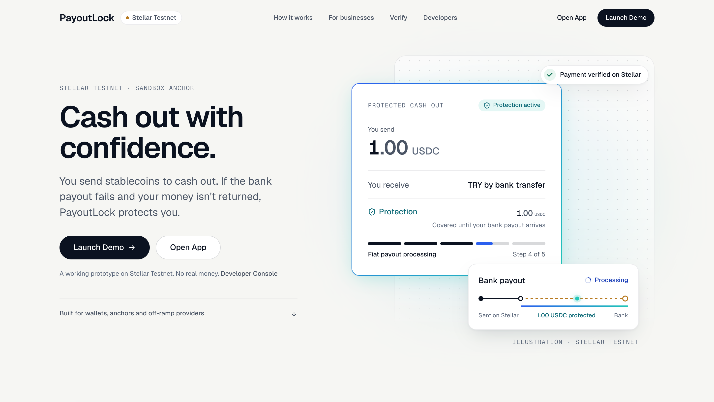
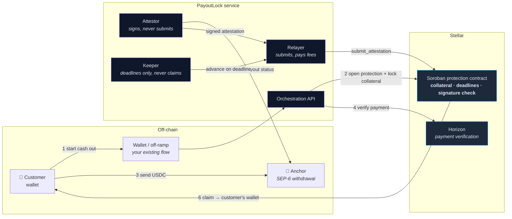
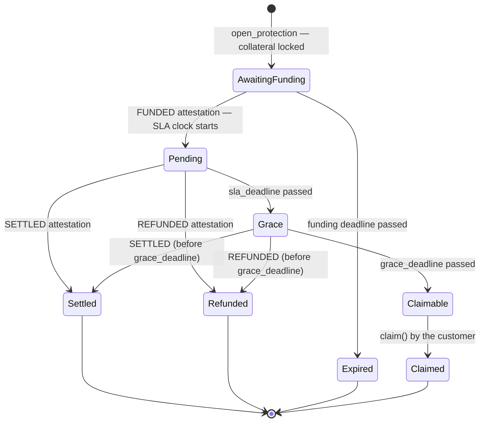
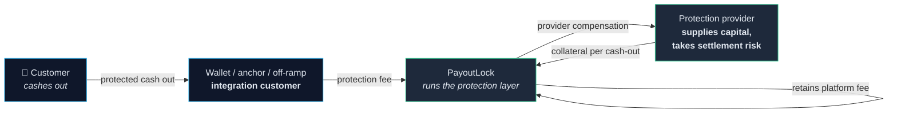

<div align="center">

# PayoutLock

**Protection for the settlement gap — the window between an on-chain stablecoin payment that is final in seconds and an off-chain bank payout that isn't.**

Someone cashes out USDC to their bank account. The on-chain half is final immediately; the bank transfer happens off-chain and can take hours, stall, or never arrive. PayoutLock locks collateral on Stellar for the length of that window — if the payout never arrives and the money isn't returned, the customer claims that collateral with their own transaction.

[](https://payoutlock.vercel.app/)

**[🌐 Live prototype](https://payoutlock.vercel.app/)** &nbsp;·&nbsp; **[▶️ Launch Demo](https://payoutlock.vercel.app/)** &nbsp;·&nbsp; **[⛓️ Contract on Stellar Testnet](https://stellar.expert/explorer/testnet/contract/CDLJDCOFCOZ7PPBO744NBOYWR5RYJ3UW2V5G2PULLY2FPUDFMYTFPLKF)** &nbsp;·&nbsp; **[🧾 Verified proof](#real-testnet-proof)**

<sub>The demo opens from the homepage — press **Launch Demo** there.</sub>

</div>

> [!IMPORTANT]
> **A prototype on Stellar Testnet, running against a sandbox anchor (TR Mock Anchor). No real money moves.**
>
> **Real on Testnet:** USDC payments, collateral locking and release, contract state transitions, attestation signature verification, and claims.
> **Simulated:** the bank payout *failing* and the principal being *refunded* — a sandbox anchor cannot be made to genuinely fail a wire. Those two outcomes are always labelled on screen.
>
> Not audited. Not a live financial service.

---

## What PayoutLock is

A stablecoin cash-out is two settlements pretending to be one, and only one of them is fast.

PayoutLock closes the gap with capital, not promises. **Before** the customer sends anything, a **protection provider** locks collateral equal to the cash-out amount in a Soroban smart contract. From there the ledger decides what happens: if the anchor confirms the payout, the collateral returns to the provider; if the deadline passes with nothing delivered and nothing returned, the customer claims that collateral to their own wallet.

It is **infrastructure, not a consumer app**. Wallets, anchors and off-ramp providers integrate it; their customers see a *Protected Cash Out*.

---

## Live prototype

Deployed and reachable now — nothing to install.

### 👉 [https://payoutlock.vercel.app/](https://payoutlock.vercel.app/)

That page is the product story — the settlement gap, the protected cash out, who it's for, and the real Testnet records. Everything else opens from it:

| From the homepage | What you get |
|---|---|
| **Launch Demo** | **Start here.** Three scenarios end to end, each writing real transactions to Stellar Testnet |
| **Open App** | The real Protected Cash Out flow against the sandbox anchor |
| **Developer Console** | Raw contract state, every lifecycle transition, manual operator controls |

The React app is hosted on Vercel; the orchestration API runs on Railway and is the one the deployed frontend talks to. Both point at the same Testnet contract linked above:

```console
$ curl -s https://payoutlock-production.up.railway.app/api/config
{"contractId":"CDLJDCOFCOZ7PPBO744NBOYWR5RYJ3UW2V5G2PULLY2FPUDFMYTFPLKF", …,
 "networkPassphrase":"Test SDF Network ; September 2015","demoMode":true}
```

You need [Freighter](https://www.freighter.app/) set to Testnet. The demo funds its own scenarios; the app additionally needs Testnet USDC in the wallet.

---

## The problem

| | On-chain leg | Off-chain leg |
|---|---|---|
| **What happens** | Customer sends USDC | Anchor wires fiat to a bank account |
| **Settles in** | Seconds | Hours to days |
| **Final?** | Yes, irreversibly | Maybe |
| **Visible?** | Publicly, on the ledger | Only to the anchor |

The customer's side completes first and cannot be reversed. The anchor's side is opaque, slower, and depends on banking rails, compliance holds and correspondent banks. In between sits an exposure nobody owns:

- The **customer** has already paid, and has no on-chain recourse.
- The **wallet** or off-ramp gets the support ticket for a failure in someone else's rails.
- The **anchor** can see the problem but has no standard way to compensate for it.

Existing tooling makes the on-chain leg faster and cheaper. None of it covers the gap the on-chain leg leaves behind.

## The solution

```
Customer sends USDC ──────────▶ Anchor pays the bank ──────────▶ Payout arrives
                    └──────── protection collateral locked ─────┘
```

PayoutLock makes the settlement gap a position someone holds and settles on-chain. Collateral is locked up front, and the protection follows deadlines recorded on the ledger:

| Outcome | What triggers it | Where the collateral goes |
|---|---|---|
| ✅ **Settled** | Anchor confirms the payout completed | Back to the protection provider |
| ↩️ **Refunded** | The customer's USDC is returned instead | Back to the protection provider |
| 🛡️ **Claimed** | Deadline passes, nothing was returned | Customer claims it to their own wallet |
| ⏳ **Expired** | Customer never funded the cash out | Back to the protection provider |

Three properties make this credible rather than a promise:

1. **Collateral is locked before the customer is exposed**, not after a dispute.
2. **A failed payout never pays out by itself.** Protection becomes claimable only once the on-chain grace deadline passes *and* the principal hasn't come back — the contract enforces both.
3. **Claiming is the customer's own transaction**, and the contract pays the address stored on the record, never the caller.

> **The contract never sees the bank and never holds the customer's principal.** It acts on signed attestations, on-chain deadlines, and the collateral locked inside it. Everything it knows about the fiat world arrives as a signed message.

---

## Demo scenarios

**Launch Demo** on the [homepage](https://payoutlock.vercel.app/) runs three scenarios against the deployed contract. Every one writes real transactions to Stellar Testnet — what's simulated is only the *bank's behaviour*.

| Scenario | The bank outcome | On-chain result |
|---|---|---|
| **Payout arrives** | 🟢 Real — the sandbox anchor completes the withdrawal | `SETTLED` attestation, collateral released |
| **Payout fails** | 🟡 Simulated failure | Real `Grace → Claimable` transitions, real `claim()` paying the customer's wallet |
| **Principal returned** | 🟡 Simulated refund | Real `REFUNDED` attestation, collateral released |

### What's real and what's simulated

<table>
<tr><th>✅ Real on Stellar Testnet</th><th>🟡 Simulated</th></tr>
<tr><td>

- USDC payments from the customer's wallet
- Collateral locking and release by the contract
- Funding verification against Horizon
- Attestation signing and ed25519 verification on-chain
- Every state transition (`AwaitingFunding → Pending → Grace → Claimable`)
- `claim()` paying out to the customer's address
- The anchor happy path (SEP-10 auth, SEP-6 withdrawal, SEP-38 quote)

</td><td>

- A bank payout **failing**
- A principal **refund** being issued
- The fiat source behind those two outcomes

</td></tr>
</table>

The demo is kept physically apart from the product flow: `/app` contains no "simulate" controls of any kind, and `/app/demo` carries a permanent **"Stellar Testnet · Simulated fiat outcome"** ribbon on every screen.

---

## Architecture



**Protection lifecycle** — the contract's own state machine:



Four Stellar accounts hold strictly separate powers, so no single key can both assert an outcome and pay for it:

| Role | Can do | Cannot do |
|---|---|---|
| **Attestor** | Sign attestation payloads (ed25519) | Submit any transaction |
| **Relayer** | Submit transactions, pay fees | Sign attestations, move collateral |
| **Protection provider** | Open protections, lock collateral | Claim, or alter an outcome |
| **Customer** | Fund the cash out, `claim()` | Advance state |

<details>
<summary><b>Why the keeper and the attestor are separate things</b></summary>

The **attestor** is the only component that makes a claim about the fiat world. It reads the anchor's payout status and signs a payload; the contract verifies that signature against a pubkey fixed at deploy time.

The **keeper** makes no claims at all. It only pushes protections past deadlines that the ledger itself can see (`advance_to_grace`, `advance_to_claimable`, `expire_unfunded`) — all permissionless contract functions anyone can call. **It never calls `claim()`.** Claiming is the customer's own action, always.

This split is what keeps the trust surface small: forging an outcome requires the attestor key, and holding the attestor key still doesn't let you move anyone's money.

</details>

---

## Why Stellar

The settlement gap isn't a generic blockchain problem — it's a property of how stablecoins reach bank accounts, and Stellar is where that path is most standardised.

- **The off-ramp is a first-class protocol here.** SEP-10 authentication, SEP-6 withdrawals and SEP-38 quotes mean PayoutLock can attach to *any* compliant anchor through one integration instead of bespoke work per partner. The gap PayoutLock covers is exactly the one those SEPs leave open: they define how to request a payout, not what happens when it doesn't arrive.
- **Soroban gives the contract precisely the primitives this needs** — custody of collateral, `ed25519_verify` for attestations, ledger timestamps for deadlines, and cheap persistent storage keyed by the anchor's own withdrawal ID.
- **Fees and finality make per-transaction protection viable.** Protecting a 1 USDC cash-out means four or five contract calls; on Stellar that costs fractions of a cent. On a chain with meaningful gas, protection would cost more than the risk it covers.
- **Ledger time, not wall clock.** Every deadline compares against `env.ledger().timestamp()`, so no off-chain clock can advance a protection early.
- **USDC is already the settlement asset** on Stellar via the SAC interface, so collateral and principal are denominated in the same thing the customer is cashing out.

---

## Real Testnet proof

Every claim on the landing page points at a transaction anyone can open. These are not examples or placeholders.

**Protection contract** &nbsp;·&nbsp; [`CDLJDCOFCOZ7PPBO744NBOYWR5RYJ3UW2V5G2PULLY2FPUDFMYTFPLKF`](https://stellar.expert/explorer/testnet/contract/CDLJDCOFCOZ7PPBO744NBOYWR5RYJ3UW2V5G2PULLY2FPUDFMYTFPLKF)

| Outcome | Amount | Transaction | Recorded |
|---|---|---|---|
| **Settled** — real sandbox anchor payout | 1.00 USDC | [`968d4b62…20817a`](https://stellar.expert/explorer/testnet/tx/968d4b6203209c7a08c42e38f0a66ffc8303e3b76311e97ff86f6f988820817a) `submit_attestation` | 19 Sep 2026, 10:49:42 UTC |
| **Claimed** — simulated payout failure, real claim | 0.10 USDC | [`6a72062c…0ed221`](https://stellar.expert/explorer/testnet/tx/6a72062cb700739c8730341f4461d8b2c4b38ef9d404d9148e6be316d70ed221) `claim` | 19 Sep 2026, 10:05:02 UTC |

These aren't taken on trust either — the repo re-checks them against Horizon:

```bash
cd web && npm run proof:verify
```

It asserts, for each record, that the transaction exists and succeeded, that its ledger closed when we say it did, and that it invoked *this* contract, with the expected function, on the expected protection, for the expected amount. Testnet is reset periodically; when that happens this command fails and the records must be replaced with a fresh run rather than left as dead links.

---

## Business model

PayoutLock is a B2B2C protection layer. It doesn't replace wallets or off-ramp providers — it adds a layer to the cash-out flow they already run.



| Party | Role | What they get |
|---|---|---|
| **Wallets, anchors, off-ramp providers** | Integration customers. They embed protected cash-outs in the flow they already operate | A safer cash-out product without building settlement infrastructure |
| **Protection providers** | Supply the collateral and take the settlement risk on each cash-out | Compensation out of the protection fee, for capital locked only for the length of the gap |
| **PayoutLock** | Runs the protection layer: contract, attestor, keeper, integration surface | Retains a platform fee from the protection fee |

One protected cash-out: the integrating business pays a **protection fee**, which splits into **provider compensation** and a **PayoutLock platform fee**. Because collateral is released as soon as the payout resolves, the same capital can back many cash-outs over time.

> [!NOTE]
> **This is a hypothesis, not validated pricing.** No fee level, split or unit economics has been tested with a real counterparty, and the Testnet prototype charges no protection fee at all. No wallet or off-ramp integration is live. The numbers that would make this work — how often payouts actually fail, what providers need to be paid for that risk, what integrators will pay — are exactly what a pilot would have to establish.

---

## Tech stack

| Layer | Stack |
|---|---|
| **Contract** | Rust · Soroban SDK 28 · `no_std` · target `wasm32v1-none` |
| **Orchestration** | Node (native TypeScript stripping) · Express 5 · `@stellar/stellar-sdk` 17 |
| **Web** | React 19 · TypeScript · Vite 8 · Tailwind CSS v4 · Motion · Stellar Wallets Kit |
| **Anchor** | SEP-10 auth · SEP-6 withdrawal · SEP-38 quote (TR Mock Anchor sandbox) |
| **Hosting** | Vercel (web) · Railway (API) · Stellar Testnet |

```
contract/    Soroban contract: lifecycle, collateral, attestation verification (~500 LOC, 1,132 LOC of tests)
attestor/    Orchestration API, attestor signing, relayer, funding verification, keeper
web/         React app: landing (/), Protected Cash Out (/app), demo (/app/demo), console (/developer)
docs/        Contributor documentation
```

Frontend contributors: see **[docs/WEB_ARCHITECTURE.md](docs/WEB_ARCHITECTURE.md)** for the `src/` layout, the CSS-isolation rules, design tokens, the landing-page internals and the full test matrix.

<details>
<summary><b>Contract interface</b></summary>

| Function | Auth | Effect |
|---|---|---|
| `open_protection(gp, withdrawal_id, memo, user, amount, funding/sla/grace durations)` | Provider signs | Locks collateral, opens in `AwaitingFunding` |
| `submit_attestation(payload, signature)` | Permissionless caller, **authority is the signature** | Applies `FUNDED` / `SETTLED` / `REFUNDED` / `FAILED` |
| `advance_to_grace(id)` · `advance_to_claimable(id)` · `expire_unfunded(id)` | Permissionless, time-gated | Deadline-driven transitions |
| `claim(id)` | Permissionless caller | Pays the **address on the record**, never the caller |
| `get_protection(id)` · `domain_id()` | Read-only | State, and the expected domain separator |

There is no public `initialize()` — the attestor pubkey and USDC address are set in `__constructor` at deploy time, which removes the bootstrap front-running risk entirely.

`submit_attestation` validates in a locked order: record exists → state accepts this status (time-gated for `Grace`) → nonce unused *(read only)* → domain matches → all fields match the record → canonical XDR encode → `ed25519_verify` *(panics, aborting atomically, on a bad signature)* → **only then** the nonce is consumed and the transition applied.

</details>

<details>
<summary><b>API surface</b></summary>

| Endpoint | Purpose |
|---|---|
| `GET /api/config` | Contract, asset and network identifiers — public, non-secret |
| `GET /api/protections/:anchorWithdrawalId` | On-chain protection record |
| `GET /api/provider-liquidity` | Provider's available USDC, for the compose pre-flight |
| `GET /api/auth/challenge` · `POST /api/auth/verify` | Wallet session (SEP-10 style challenge) |
| `POST /api/live/open-protection` | Opens a protection for a real anchor withdrawal |
| `POST /api/live/check-funding` · `check-settlement` | Verifies the payment on Horizon; asks the anchor for the payout status |
| `POST /api/demo/failure/*` · `refund/*` · `check-funding` | Demo scenarios — mounted **only** when `DEMO_MODE=true` |

</details>

<details>
<summary><b>The keeper</b></summary>

A thin, permissionless state-advancement loop (`attestor/src/server/keeper.ts`, rules in `keeperCore.ts`). The relayer submits calls that the contract lets anyone make. It runs inside the API process every `KEEPER_INTERVAL_SECONDS`, and every comparison uses **ledger time, not wall clock**.

| State | Condition | Keeper action |
|---|---|---|
| `Pending` | `sla_deadline` passed | `advance_to_grace` |
| `Grace` | `grace_deadline` passed | `advance_to_claimable` — for live protections **only** if the anchor is freshly observed to be unresolved |
| `AwaitingFunding` | `funding_deadline` + buffer passed **and** no matching payment on-chain | `expire_unfunded` |
| `Claimable` | — | nothing. **The keeper never calls `claim()`** |
| any terminal state | `Settled` / `Refunded` / `Claimed` / `Expired` | release the wallet's protection slot, forget any held anchor token |

A wallet's slot is *also* released right before the per-wallet cap check on every `open` route, so a protection that just finished never causes a spurious `429`. Releasing is idempotent.

**The live-protection guard.** Demo protections (`demo-failure`, `demo-refund`) are synthetic — there is no anchor to consult — so they progress automatically. A **live** protection moves `Grace → Claimable` only when, in that same tick, the anchor positively reports the payout unresolved (`pending_*`, `on_hold`, `incomplete`, `error`, `expired`, `no_market`, `too_small`, `too_large`). Everything else holds it in `Grace`: no anchor credentials, an expired or rejected token, a network or anchor error, a `completed`/`refunded` status, or a status the keeper doesn't recognise. **Failing to observe is never treated as evidence that the payout failed** — otherwise a lookup error would become a double recovery against the provider. `Pending → Grace` stays automatic, since a `SETTLED` attestation is still accepted during `Grace`.

| Variable | Default | Meaning |
|---|---|---|
| `KEEPER_ENABLED` | `true` | `false` leaves only the `/developer` manual controls |
| `KEEPER_INTERVAL_SECONDS` | `10` | tick interval |
| `KEEPER_EXPIRE_BUFFER_SECONDS` | `30` | extra time past `funding_deadline` before an unfunded protection may be expired (Horizon lag, sweep interval) |
| `MAX_ACTIVE_PROTECTIONS_PER_WALLET` | `2` | per-wallet cap |
| `MAX_PROTECTED_AMOUNT_STROOPS` | `20000000` | 2 USDC per protection |

Manual controls in `/developer` remain the operator fallback and are unchanged.

</details>

---

## Local setup

Requires **Node ≥ 22** (for native TypeScript stripping). Contract work additionally needs **Rust** with the `wasm32v1-none` target and the [Stellar CLI](https://developers.stellar.org/docs/tools/developer-tools/cli/stellar-cli) 28.

The contract is already deployed to Testnet and its ID ships in `attestor/.env.example`, so you do **not** need to build or deploy it to run the app.

### 1. Contract *(optional)*

```bash
cd contract
cargo test                                          # full lifecycle test suite
cargo build --target wasm32v1-none --release        # build the wasm
```

### 2. Orchestration API

```bash
cd attestor
cp .env.example .env    # fill in the Testnet identities — .env is git-ignored, never commit it
npm install
npm run server          # API on :8787
npm run server:demo     # same, with /api/demo/* mounted (DEMO_MODE=true)
npm test                # hermetic unit tests: no env, no secrets, no network
```

Each role is a **separate** Stellar account — never reuse one key across roles. The attestor key only signs attestations; the relayer only submits transactions and pays fees; the protection provider (`guarantee_provider` in the contract) opens protections and locks collateral. Fund them from [friendbot](https://friendbot.stellar.org) and add a USDC trustline.

### 3. Web app

```bash
cd web
cp .env.example .env    # VITE_API_URL — defaults to http://localhost:8787
npm install
npm run dev             # http://localhost:5173
```

This is a single-page app: any host must serve `index.html` for unknown paths, or deep links like `/app/cash-out/…` break on refresh. `vite dev` and `vite preview` do this already.

<details>
<summary><b>Tests and tooling</b></summary>

```bash
# web/
npm test              # unit: cash-out view logic, landing copy, claims, proof format, scene timing
npm run flows         # real Chrome against /app and /app/demo with a simulated chain/anchor
npm run landing       # real Chrome on the landing page: claims, links, overflow at six widths,
                      # the pinned scene, phone layout, reduced motion, keyboard, measured contrast
npm run proof:verify  # re-checks the Testnet proof records against Horizon (read-only, no keys)
npm run parity        # /developer identity + pixel/computed-style parity + route checks
npm run lint          # oxlint
npm run build         # tsc -b && vite build
```

Full detail in [docs/WEB_ARCHITECTURE.md](docs/WEB_ARCHITECTURE.md).

**Real Testnet scenarios** (`attestor/`) — each needs a running API and funded identities, and spends real Testnet USDC. The header of each script states its cost.

| Command | What it proves |
|---|---|
| `npm run scenario-failure-claim` · `scenario-refund` | the simulated failure and refund paths, driven directly |
| `npm run scenario-keeper` | the keeper advances `Pending → Grace → Claimable` with no manual call; slots free up after a claim and after an expiry |
| `npm run scenario-keeper-live -- lifecycle` | free: a live protection is opened but never funded; the keeper expires it and frees the slot |
| `npm run scenario-keeper-live -- settle` | the real happy path against the mock anchor: fund → anchor completes → `check-settlement` → `Settled`. Costs the customer 1 USDC |
| `npm run scenario-keeper-live -- guard` | the live guard: funded then left alone, the keeper must not advance while the anchor says `completed`. Ends in a claim, so it needs a provider holding ≥ 2 USDC and refuses to run otherwise |

Start the API for the keeper scenarios with:

```bash
DEMO_MODE=true MAX_ACTIVE_PROTECTIONS_PER_WALLET=1 \
KEEPER_INTERVAL_SECONDS=5 KEEPER_EXPIRE_BUFFER_SECONDS=5 npm run server
```

The mock anchor enforces a **1 USDC** minimum withdrawal, though its `/sep6/info` advertises 0.5.

</details>

---

## Security and trust model

PayoutLock is **not** a trust-free system, and it's worth being exact about where the trust sits.

**What you must trust:** the **attestor key**, for the truth about what the bank did. The contract cannot observe an anchor; it verifies an ed25519 signature against a pubkey fixed at deploy time. A compromised attestor key could assert a settlement that never happened and release collateral early, or assert a failure that didn't occur.

**What you don't have to trust:** everything else is enforced by the contract.

| Guard | How |
|---|---|
| **Signature is the only authority** | `submit_attestation` is permissionless. Who submits it is irrelevant; a wrong signature panics and aborts the whole invocation atomically |
| **No cross-contract or cross-network replay** | `domain_id = sha256(network_id ‖ contract_address)` is derived from the ledger and the contract's own identity, and checked on every attestation |
| **No attestation replay** | A 32-byte nonce is consumed — but only *after* the signature verifies, so a failed attempt can't burn a valid nonce |
| **No claim without funding** | Protections open in `AwaitingFunding`, never directly `Pending`. The SLA clock starts only once a `FUNDED` attestation is accepted |
| **No late settlement** | Once `grace_deadline` passes the contract refuses `SETTLED` — a closed door, not a race |
| **Claims can't be redirected** | `claim()` pays the address on the record, never the caller |
| **No time manipulation** | Every deadline compares against ledger time |
| **No key does two jobs** | The attestor cannot submit; the relayer cannot sign; the provider cannot claim |
| **Overflow safety** | `open_protection` checks the worst-case deadline chain up front, so the later computation can never overflow |

<details>
<summary><b>How the anchor JWT is handled</b></summary>

To ask the anchor about a payout, the backend keeps the customer's SEP-10 JWT from `open-protection` (refreshed by `check-settlement`). This is a deliberate, narrow exception to "the backend never holds the JWT", and it exists so the keeper can *fail safe* rather than advance blind:

- **memory only**, keyed by protection — never written to disk, logs, API responses, or the browser
- the only reader is the keeper's anchor observation; nothing can list or serialise what is held
- dropped at any terminal state, and when the token is within 30 s of its `exp`
- error text passes through a redaction step before it can be logged

In the browser the session and anchor JWT are likewise memory-only; `localStorage` holds nothing but a protection reference.

</details>

---

## Prototype limitations

Read these before treating any part of this as production infrastructure.

### Attestor liveness — nothing watches the anchor on its own

A `SETTLED` attestation is produced only when someone holding the customer's anchor JWT asks the backend to confirm the payout (`/api/live/check-settlement`) while the protection is still `Pending` or `Grace`. The web app does this automatically **while its tab is open**. The backend does not monitor the anchor by itself, and holds all protection state in memory.

So if the tab is closed, the JWT is unavailable or expired, or the backend restarts, nothing settles the protection. The system's answer is to fail closed rather than fail wrong:

- The keeper will **not** move a live protection from `Grace` to `Claimable` without a fresh anchor observation that the payout is unresolved. Failure to observe is never read as evidence of failure. This protects the provider from a double recovery — at the cost of liveness: the collateral stays locked until an operator intervenes via `/developer`.
- A payout that completes after the grace deadline can no longer be settled; the contract refuses `SETTLED` past `grace_deadline`.

**Production would need** persistent server-side settlement monitoring, an anchor webhook or another reliable settlement data source — plus durable storage for protection state.

### Everything else

| Limitation | Detail |
|---|---|
| **In-memory backend state** | Protections opened before a restart are no longer tracked by the funding sweep or the keeper; use the `/developer` manual controls for those |
| **Demo-scale caps** | At most 2 USDC per protection and 2 active protections per wallet (configurable) |
| **Simulated outcomes are simulated** | The mock anchor cannot genuinely fail a payout or refund principal, so those paths are demonstrated at `/app/demo` with a simulated fiat source — always labelled as such |
| **One protection provider** | A single account funds all collateral. There is no pooling, no pricing engine, no risk model, no underwriting |
| **No economic validation** | The business model above is a hypothesis; no fee is charged and no unit economics have been tested |
| **Sandbox anchor only** | One mock anchor (TR Mock Anchor), one corridor, one asset. No real anchor or payout partner is integrated |
| **Not audited** | No security audit has been performed on the contract or the backend |
| **Wallet support** | Desktop Freighter via Stellar Wallets Kit; mobile wallets are not supported |

---

<div align="center">

**PayoutLock** · a prototype on Stellar Testnet with a sandbox anchor · not a live financial service

[Live prototype](https://payoutlock.vercel.app/) · [Contract](https://stellar.expert/explorer/testnet/contract/CDLJDCOFCOZ7PPBO744NBOYWR5RYJ3UW2V5G2PULLY2FPUDFMYTFPLKF) · [Web architecture](docs/WEB_ARCHITECTURE.md)

</div>
